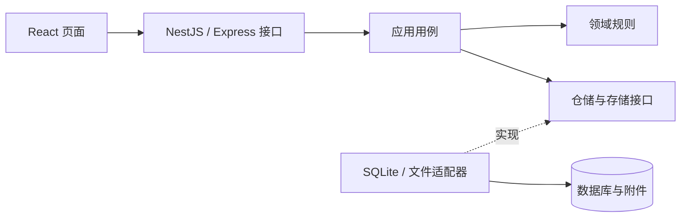

# 日序 · 团队日报与项目进度

日序帮助团队成员记录每日工作，将日报中的工作条目归集到项目和任务，并通过可关闭的公开链接分享进展。

项目采用 **TypeScript 全栈 + DDD 模块化单体**。React 页面与 NestJS（Express 适配器）接口同源运行，SQLite 保存业务数据，附件保存在本地私有目录。团队日报和公开页的进展日报采用桌面多列瀑布流卡片。

当前提供单团队、本机运行版本。公开链接支持免登录读取；外网访问仍需完成部署适配。

[快速开始](#快速开始) · [配置](#配置) · [技术架构](#技术架构) · [开发与验证](#开发与验证) · [数据与备份](#数据与备份) · [常见问题](#常见问题)

## 功能与使用流程

| 功能       | 当前行为                                                                  |
| ---------- | ------------------------------------------------------------------------- |
| 成员与邀请 | 本机建立首位成员；邮箱密码登录；任何成员均可邀请，邀请 7 天有效且单次使用 |
| 私人草稿   | 每人可创建多份日报，保存段落、工作条目和附件；草稿仅作者可读写            |
| 日报提交   | 按首次提交的北京时间确定日报日期；提交后更新团队、项目及公开阅读内容      |
| 项目与任务 | 条目可关联一个项目及该项目下的任务，也可记录临时工作或随提交创建任务      |
| 任务状态   | 明确选择新状态才触发更新；支持版本冲突处理和操作记录                      |
| 团队阅读   | 按日期、成员、项目组合筛选；命中项目后仍展示完整日报                      |
| 公开分享   | 日报、项目、任务分别生成链接，可选择概览、任务列表、进展日报模块          |
| 归档与附件 | 创建者管理归档；附件下载依据当前可见内容及分享范围重新授权                |

开始使用：

1. 首位成员建立团队，生成邀请链接，复制并发送给同事；受邀者创建自己的账号。邀请被接受前，生成者可撤销邀请。
2. 在“我的日报”新建记录。换行仍属于当前工作条目，“新增一条工作”创建新的内容边界。
3. 输入 `@` 或点击“关联项目”，选择整个条目的项目归属；按需选择任务或填写新任务。
4. 保存草稿后点击“提交”，团队及关联项目即可读取提交版本。
5. 在“公开分享”选择对象、日期范围和开放模块，生成只读链接。

### 日期、修改与任务规则

- 日报日期由首次提交时的服务器北京时间确定，没有补写日期入口。跨日未提交草稿可继续编辑，首次提交归入实际提交当天。
- 已提交日报仅作者可在首次提交当天修改、再次提交或删除；过去日期的已提交日报及未重提修改均锁定。
- 保存修改只更新私人草稿；再次提交后，团队、项目和公开页才读取新版本。
- `@项目` 关联整个工作条目，不会仅凭文字自动创建任务；随提交创建任务需要明确填写新任务。
- 同一份提交中的任务创建、状态更新、变更记录和日报发布一起成功或回滚。冲突处理后再次提交仍会校验最新任务版本。
- 日报保留提交时的任务名称和状态快照；任务列表展示当前任务状态。
- 项目与任务采用扁平管理，任意成员可创建，只有创建者可修改定义及归档/恢复。

### 公开范围

| 链接类型 | 进展日报范围                                                     | 任务列表范围       |
| -------- | ---------------------------------------------------------------- | ------------------ |
| 日报     | 所选日期内，全团队成员的全部完整已提交日报，包含未关联项目的工作 | 这些日报引用的任务 |
| 项目     | 所选日期内，关联指定项目的工作条目                               | 指定项目下的任务   |
| 任务     | 所选日期内，关联指定任务的工作条目                               | 指定任务           |

日期筛选作用于日报日期。只有勾选的模块才会出现在公开响应中；草稿、未重提修改和成员邮箱不会公开。持链接者可免登录读取开放内容，只有生成者可主动关闭链接。

归档项目会关闭该项目及其任务的专属链接；归档任务会关闭该任务的专属链接，相关公开附件下载同时失效。恢复归档不会重开这些链接。全团队日报链接继续保留所选日期内的完整历史条目。

## 快速开始

环境要求：

- Node.js **24.15.0 ≤ 版本 < 25**，与 [package.json](package.json) 的 `engines` 一致。
- npm 和 Git；运行应用无需另装 SQLite 服务。
- 运行浏览器测试默认使用 Microsoft Edge；也支持 Playwright 配套 Chromium，配置见下文。

在 PowerShell 或终端中执行：

```sh
git clone https://github.com/baiqiuran/Teamwork.git
cd Teamwork
npm ci
npm run build
npm start
```

以上命令均在包含 `package.json` 的仓库根目录运行。打开 [本机应用](http://127.0.0.1:4310)。

首次启动会自动建立数据目录及数据库，并在终端打印带引导密钥的创建团队链接。打开该链接，填写团队名称、姓名、邮箱和密码。**没有预置账号或默认密码**，密码长度为 12–128 个字符。创建成功后使用自己的邮箱密码登录。

`npm start` 使用 Node 运行编译后的 NestJS 服务，同时提供构建后的前端页面和 `/api` 接口。停止服务可在运行终端按 `Ctrl+C`；重启后账号、日报及附件仍保留。

## 配置

| 环境变量              | 默认值                   | 作用                                                         |
| --------------------- | ------------------------ | ------------------------------------------------------------ |
| `PORT`                | `4310`                   | HTTP 端口，必须是 1–65535 的整数                             |
| `DAILY_DATABASE_PATH` | `data/daily-flow.sqlite` | 数据库路径；相对路径以启动时的工作目录为基准，父目录自动创建 |
| `DAILY_SETUP_KEY`     | 每次启动随机生成         | 首次建立团队的引导密钥；团队建立后不再用于登录               |

附件固定存放在数据库同级的 `attachments/` 目录。切换数据库路径时，也要考虑对应附件目录；同目录下的多个数据库会共用这一附件目录。

PowerShell 示例：

```powershell
$env:PORT = "4320"
$env:DAILY_DATABASE_PATH = Join-Path $PWD.Path "data/daily-flow.sqlite"
npm start
```

Bash 示例：

```bash
PORT=4320 DAILY_DATABASE_PATH=./data/daily-flow.sqlite npm start
```

应用从进程环境读取配置，**不会自动加载 `.env` 文件**。如需固定引导密钥，请通过终端或进程管理器设置 `DAILY_SETUP_KEY`。默认随机密钥在尚未建立团队时重启会变化，以本次终端输出的链接为准。

当前监听地址固定为 `127.0.0.1`；修改 `PORT` 只改变端口。外部访问还受到 HTTP Host 和 Origin 校验限制，详见下方部署边界。

## 技术架构

| 部分       | 技术与职责                                                                |
| ---------- | ------------------------------------------------------------------------- |
| 前端       | React 19、TypeScript 7、Vite 8、原生 CSS；通过同源 HTTP/JSON 接口读写数据 |
| 后端       | Node.js 24、NestJS 12、Express 5，运行编译后的 JavaScript                 |
| 校验       | Zod 4，处理输入格式和领域内容约束                                         |
| 数据库     | Node 内置 `node:sqlite`，原生 SQL 仓储、WAL、外键及同步事务               |
| 文件       | 本地私有目录，数据库保存附件归属与元数据                                  |
| 身份与安全 | scrypt 密码哈希、Cookie 会话、Helmet、认证接口限流、Origin 校验           |
| 验证       | Node 测试框架、真实 SQLite、Playwright、TypeScript 和架构依赖检查         |

具体依赖范围见 [package.json](package.json)，安装版本由 `package-lock.json` 固定。

业务处于同一个“团队工作进展”限界上下文，分为成员邀请、日报、项目任务、公开分享、附件五个模块。后端按 DDD 分层：

| 层                | 职责                                                         |
| ----------------- | ------------------------------------------------------------ |
| `domain`          | 日期窗口、内容约束、任务状态、邀请有效性、分享规则等领域行为 |
| `application`     | 提交、归档、上传等用例编排，读取模型及仓储/外部能力端口      |
| `infrastructure`  | SQLite 仓储、表初始化与兼容迁移、文件存储、加密实现          |
| `interfaces/http` | 路由、协议校验、Cookie、安全中间件和错误响应                 |



领域层不依赖 HTTP、数据库或文件系统。应用层使用端口，具体适配器由 `server/composition/` 中的模块与工厂 Provider 装配，`server/app.ts` 管理异步生命周期。前端按功能组织，共享接口类型、日期工具和日报阅读卡片。

### 目录结构

```text
server/
  domain/                 领域模型与规则
  application/            用例、读取模型与端口
  infrastructure/
    sqlite/               数据库初始化、迁移、仓储和事务
    files.ts              附件文件存储
    security.ts           令牌、摘要和密码处理
  interfaces/http/        HTTP 接口与中间件
  composition/            Nest 模块、Provider 和资源所有权
  app.ts                  异步应用创建、监听与关闭入口
  main.ts                 进程启动与静态资源服务
src/
  app/                    工作空间、导航与页面组合
  features/
    membership/           账号与邀请
    diaries/              日报编辑、任务关联与团队阅读
    work/                 项目与任务管理
    sharing/              分享管理与公开页
  shared/                 接口类型、工具与共用组件
  main.tsx                前端入口
  style.css               页面样式
tests/
  *.test.ts               HTTP 业务测试
  browser/                浏览器流程与布局测试
scripts/
  check-architecture.mjs   分层、循环引用和 SQL 位置检查
docs/
  architecture.md         分层与一致性说明
  adr/                    架构决策
CONTEXT.md                统一业务术语
```

`build/`、`dist/`、`data/`、`node_modules/` 和测试产物在本机生成，不纳入 Git。

### 一致性与安全

- 提交日报时，附件引用校验、随提交新建任务、任务状态更新、状态事件、日报快照和幂等回执在同一个 SQLite 事务中完成，任何一步失败都会回滚。
- 草稿版本防止旧窗口覆盖；提交请求标识防止网络重试重复产生任务或状态事件。项目/任务归档与关闭专属分享同样保持事务一致性。
- 密码使用带随机盐的 scrypt；会话和邀请仅存令牌摘要。会话 Cookie 使用 HttpOnly、SameSite=Strict，7 天有效，退出后失效。
- 写接口校验 Origin，认证接口限制尝试频率；公开响应只组装授权模块和已提交内容。
- 附件位于静态资源目录之外，内部和公开下载每次重新检查可见内容。上传发生数据库写入失败时补偿删除本次文件；进程突然退出仍可能留下无引用文件，当前不自动清理。

## 开发与验证

| 命令                         | 作用                                               |
| ---------------------------- | -------------------------------------------------- |
| `npm start`                  | 启动服务并提供 `dist/` 中的前端页面                |
| `npm run dev`                | 监听后端编译，并由 Node 重启编译后的服务           |
| `npm run build`              | 架构和类型检查、编译后端，并由 Vite 构建前端       |
| `npm run typecheck`          | 仅运行 TypeScript 检查                             |
| `npm run check:architecture` | 检查后端层次、前端功能依赖、循环引用与 SQL 位置    |
| `npm run test:api`           | 运行真实 HTTP 服务和临时 SQLite 业务测试           |
| `npm run test:ui`            | 运行 Playwright 浏览器测试，需要已有最新前端构建   |
| `npm test`                   | 按顺序运行构建、接口测试和浏览器测试               |
| `npm run test:upgrade`       | 使用基线 `4414749` 在隔离数据上验证升级及回退      |
| `npm run test:production`    | 临时目录干净安装、全量测试，再验证独立运行依赖环境 |
| `npm run format`             | 使用 Prettier 格式化源码、测试及文档               |

开发时，首次先执行 `npm run build`，再执行 `npm run dev`。当前 `dev` 命令只监听后端，没有另起 Vite 开发服务器或配置前端热更新；修改 React/CSS 后，在另一个终端执行 `npm run build` 并刷新页面。

完整验证：

```sh
npm test
```

单独验证接口或页面：

```sh
npm run test:api
npm run build
npm run test:ui
```

接口测试通过真实 HTTP 和隔离数据库验证持久化、成员隔离、跨日锁定、提交幂等、项目归集、任务冲突与回滚、筛选、模块化分享、附件及归档撤权。

浏览器测试默认使用 Edge（可选浏览器配置见 [迁移记录](docs/nestjs-migration.md#浏览器环境)），自动启动独立的 `4311` 端口服务及 `data/e2e-*.sqlite` 数据库，`reuseExistingServer` 关闭。运行前确保该端口空闲。测试覆盖编辑与提交、任务冲突、分享、附件及桌面瀑布流，也保留少量窄屏回归检查；产品布局以桌面使用为主。产物位于 `test-results/`，失败时保留 trace。

如果 Edge 创建页面超时，可使用配套 Chromium：

```powershell
npx playwright install chromium --only-shell
$env:PLAYWRIGHT_CHANNEL = "chromium"
npm run test:ui
```

`test:production` 需要 Git、npm 和已安装的测试浏览器，默认选择 Chromium。它只复制 Git 管理的源码及未忽略的新文件，在系统临时目录执行 `npm ci` 和完整测试；随后将编译产物及包清单复制到另一个目录，执行 `npm ci --omit=dev`，验证身份、提交及公开读取。两个目录都不包含真实数据，完成后清理。`test:upgrade` 需要本仓库的 `4414749` 历史和开发依赖，运行前先构建后端。

## 数据与备份

默认数据布局：

```text
data/
  daily-flow.sqlite       账号、邀请、日报、项目任务、分享与附件元数据
  daily-flow.sqlite-wal   SQLite WAL 文件，运行时可能存在
  daily-flow.sqlite-shm   SQLite 共享内存文件，运行时可能存在
  attachments/            按附件 ID 保存的文件内容
```

启动时自动执行幂等建表和已有的追加列迁移。Nest 迁移沿用现有 SQLite 表与内容格式，旧数据可继续使用。升级和回退的隔离演练、已验证范围见 [迁移记录](docs/nestjs-migration.md)。实际切换前仍应按下列流程备份，并停止原服务后再启动新服务。

备份与恢复采用以下停机流程：

1. 停止所有访问该数据库的应用进程，等待服务退出。
2. 默认配置下复制完整 `data/` 到仓库外的独立备份目录；自定义路径时，同批备份目标数据库、仍存在的 WAL/SHM 文件及同级 `attachments/`。
3. 恢复前保留当前数据副本，将同一批备份还原到一个独立目录，并通过 `DAILY_DATABASE_PATH` 指向还原的数据库。附件须仍在该数据库同级的 `attachments/`。
4. 启动应用，验证原账号登录、历史日报读取及附件下载，再切换使用恢复后的数据。

只备份数据库会缺少附件内容；运行中直接分别复制文件也不能保证得到同一时点的数据。备份包含团队内容和有效分享令牌，应按团队内部数据管理，不提交至 Git。

### 内容限制

| 内容     | 限制                                                 |
| -------- | ---------------------------------------------------- |
| 日报标题 | 选填，最多 100 个 Unicode 码点                       |
| 每份日报 | 最多 50 个工作条目                                   |
| 条目正文 | 每条最多 10,000 个 Unicode 码点                      |
| 提交条件 | 至少一个条目有非空正文或有效附件；草稿可不完整       |
| 附件数量 | 每条最多 10 个                                       |
| 单个附件 | 1 字节至 20 MiB（20 × 1024 × 1024 字节）             |
| 附件类型 | PNG、JPG/JPEG、WebP、PDF、TXT、CSV、DOCX、XLSX、PPTX |

附件作为下载内容提供，不在页面中内嵌执行。

## 部署边界

当前代码在本机运行：单个 Node.js 进程提供前端和 API，SQLite 与附件依赖本地持久磁盘。源码推送 GitHub 后，应用仍需启动服务才能使用。

公网部署前需要落实以下改动与配置：

- 域名、HTTPS、反向代理及进程托管。
- 根据入口调整监听方式及可信 Host/Origin 校验，并配置 HTTPS 会话 Cookie；当前不是只设置一个域名变量即可上线。
- 持久数据目录、读写权限、备份与恢复流程。
- 构建时安装开发依赖；运行时保留 `build/server/`、`dist/`、包清单、锁文件与运行依赖。`npm start` 不再依赖 `tsx`、编译器或 Nest CLI。

当前业务范围为单团队、邀请加入和只读公开分享；尚未提供邮件发送、密码找回、审批、多团队或自动化公网部署。

## 常见问题

| 现象                             | 排查方式                                                                                       |
| -------------------------------- | ---------------------------------------------------------------------------------------------- |
| 找不到默认账号                   | 首次用终端打印的引导链接创建团队；已有团队使用自己注册的邮箱密码                               |
| 页面提示“请先运行 npm run build” | 在仓库根目录完成构建，再刷新页面                                                               |
| 修改页面后没有变化               | `npm run dev` 只监听后端；重新构建前端并刷新                                                   |
| 端口被占用 / `EADDRINUSE`        | 停止占用端口的已知服务，或设置其他 `PORT`；浏览器测试固定使用 4311                             |
| 页面提示只能本机访问或来源不匹配 | 从同一 `127.0.0.1` / `localhost` 地址和端口打开页面；当前 Host/Origin 校验不会接受任意外部域名 |
| 同事打不开分享链接               | `127.0.0.1` 指向打开链接者自己的电脑；跨电脑访问需完成部署适配                                 |
| 重启后进入创建团队页面           | 检查工作目录及 `DAILY_DATABASE_PATH`，确认指向原数据库，不要直接另建团队                       |
| 历史日报无法修改                 | 这是首次提交日期的锁定规则；服务器以北京时间判断当天                                           |
| 分享附件下载失败                 | 检查链接是否关闭、对象是否归档、是否开放进展模块，以及附件是否仍在可见的已提交内容中           |
| 浏览器测试找不到浏览器           | 检查本机 Edge，或安装配套 Chromium 并设置 `PLAYWRIGHT_CHANNEL=chromium`                        |

## 进一步阅读

- [业务术语](CONTEXT.md)：团队、日报、工作条目、任务及公开链接的统一含义。
- [架构与事务说明](docs/architecture.md)：领域边界、依赖方向、发布流程与一致性。
- [ADR 0001：模块化单体](docs/adr/0001-modular-monolith.md)：当前架构选择及原因。
- [运行与构建脚本](package.json)、[浏览器测试配置](playwright.config.ts)。

产品讨论及本地任务记录保留在原开发工作区，运行本仓库不依赖这些外部文件。

迁移的逐项进度与兼容验证见 [NestJS 迁移记录](docs/nestjs-migration.md)。
