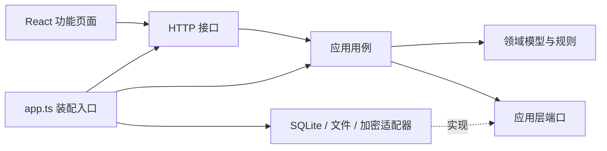

# 日序的 DDD 架构

## 边界与职责

日序采用模块化单体，只有一个“团队工作进展”限界上下文。团队成员、日报、项目、任务和公开链接共同使用 [CONTEXT.md](../CONTEXT.md) 中的术语。模块是同一应用中的业务分工，不是独立部署的服务。

| 业务模块   | 领域职责                                                       | 应用层职责                                                           |
| ---------- | -------------------------------------------------------------- | -------------------------------------------------------------------- |
| 成员与邀请 | 邀请有效期、单次使用、生成者撤销权限                           | 建立唯一团队、登录会话、邀请及加入；密码计算之后在事务内重新检查邀请 |
| 日报       | 条目与内容限制、版本检查、首次提交日期、当日编辑窗口、提交快照 | 私人草稿、保存、删除、提交；协调项目任务、附件引用和提交回执         |
| 项目与任务 | 创建者权限、归档、条目关联、明确状态选择、版本冲突             | 项目任务维护、进展查询、状态事件；归档时关闭专属公开链接             |
| 公开分享   | 日期范围、目标归属、模块授权、关闭权限                         | 生成与读取三类链接；只组装授权范围内的已提交内容                     |
| 附件       | 类型、大小、数量、归属与内容引用                               | 上传幂等、上传取消、私有/公开读取授权及文件失败补偿                  |

日报是内容一致性的聚合：工作条目、附件引用、私人草稿和提交快照随它变化。任务有独立身份与版本，通过 ID 被条目引用；项目负责组织任务，不要求每次读取项目时加载所有任务。邀请和公开链接各自维护生命周期。成员身份在 HTTP 边界通过会话取得，写用例接收已认证成员 ID，公开读取用例只接受公开令牌。

## 代码分层

```text
server/
  domain/                 领域对象、值校验和纯业务规则
  application/            业务用例、查询模型、仓储及外部能力端口
  infrastructure/
    sqlite/               表初始化、兼容迁移、行映射、仓储、事务
    files.ts              本地附件字节读写
    security.ts           随机令牌、摘要、密码哈希
  interfaces/http/        路由、请求校验、Cookie、错误映射、安全中间件
  composition/            Nest 模块、工厂 Provider 与共享资源所有者
  app.ts                  异步 createApp、listen 与幂等 close
  main.ts                 进程、环境配置、本机监听及静态资源
src/
  app/                    页面组合和工作空间导航
  features/
    membership/           登录、建团队、加入与邀请
    diaries/              日报编辑、任务关联和团队日报
    work/                 项目与任务管理
    sharing/              分享管理和公开页
  shared/                 接口数据类型、请求工具、日期/状态显示和共用卡片
scripts/check-architecture.mjs
```



领域层只依赖本层和纯校验库 Zod；应用层只依赖领域及自身端口。基础设施实现端口，不调用用例。HTTP 不直接访问数据库。所有 SQL 都在 SQLite 适配目录，SQL 行名与 JSON 序列化也在那里转换，领域和应用层使用领域状态。

前端按功能组织，不复制后端四层。页面不互相导入；共同阅读的 `DiaryRecords`、状态显示、时间工具和接口类型都位于 `shared`。任务关联是日报编辑的一部分，属于日报功能。后端继续作为业务规则与权限的权威来源。

## 一致性与公开读取

提交日报在同一个同步事务中完成：

1. 查询提交回执，识别请求重试，并检查作者、日期窗口及草稿版本。
2. 校验附件归属，过滤空白工作，检查项目和任务关联。
3. 按需创建任务，统一校验所有状态选择和版本冲突。
4. 更新任务并记录状态变更事件，固化每个条目的任务名称和状态快照。
5. 保存日报提交版本、首次提交日期及幂等回执，一起提交事务。

其中任何步骤失败，新增任务、任务状态、事件、日报和回执全部回滚。项目/任务归档与关闭对应专属分享同样在一个事务里执行；恢复归档不重新开放链接。跨聚合事务是本单体的明确选择，原因见 [ADR 0001](adr/0001-modular-monolith.md)。审计记录用于追踪操作，没有引入事件溯源。

`Reading` 统一组织已提交内容。团队日报筛选命中后保留整份日报；项目和任务进展仅投影匹配的条目。公开分享叠加目标、日期和模块限制，返回明确挑选的字段。作者邮箱、私人草稿和未重提修改不会通过这些读取模型返回。历史日报中的状态来自提交快照，不随任务当前状态变化。

附件字节放在数据库旁的私有目录。上传时在事务内校验并写文件，数据库提交失败会删除本次写入的文件。数据库与文件系统没有共同的 ACID 事务；进程突然退出仍可能留下无引用文件，首版不自动清理。下载每次重新检查日报引用与分享权限，不暴露静态文件目录。

## 兼容与验证

继续使用 SQLite，保留原表、列、数据目录、HTTP 路径、Cookie 名称和 `await createApp({ databasePath, setupKey, now })` 测试入口（支持可选静态页面目录，返回异步 listen 与 close）。不需要业务数据迁移。启动时仍执行已有的幂等建表及追加列逻辑，兼容旧版本数据库。公开页及团队日报的桌面瀑布流交互不变。

```sh
npm run check:architecture
npm run typecheck
npm test
```

架构检查扫描 TypeScript/TSX 的导入及 SQL 字面量，检查后端依赖方向、前端功能隔离、SQL 位置以及循环依赖。使用项目已有的 Prettier TypeScript 解析器，不增加运行时依赖；它是针对当前静态源码的约束，不是安全沙箱。构建自动运行该检查。

业务验证保持既定边界：通过真实 HTTP、真实 SQLite 和隔离时钟验证完整行为，再用浏览器流程检查编辑、分享及布局。扩展功能时，业务规则放领域，跨仓储编排放应用，SQL 和文件操作放适配器，HTTP 只处理协议。

Nest 的 Controller、Guard、Pipe 和异常 Filter 位于 HTTP 层，模块及工厂 Provider 位于装配层；领域和应用类保持框架独立。实际迁移进度见 [迁移记录](nestjs-migration.md)。
